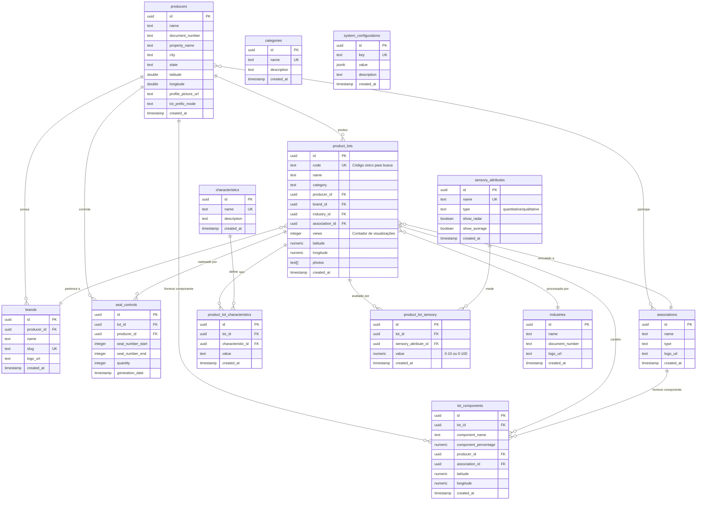
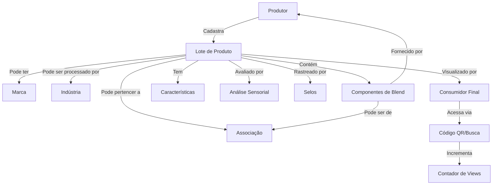
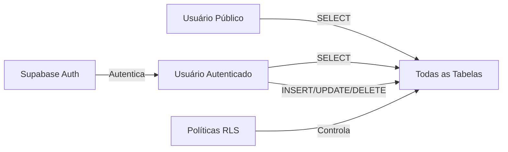
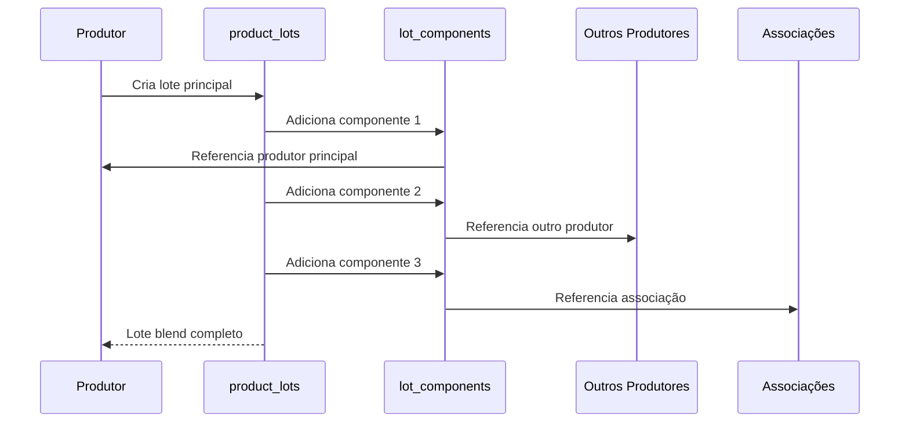
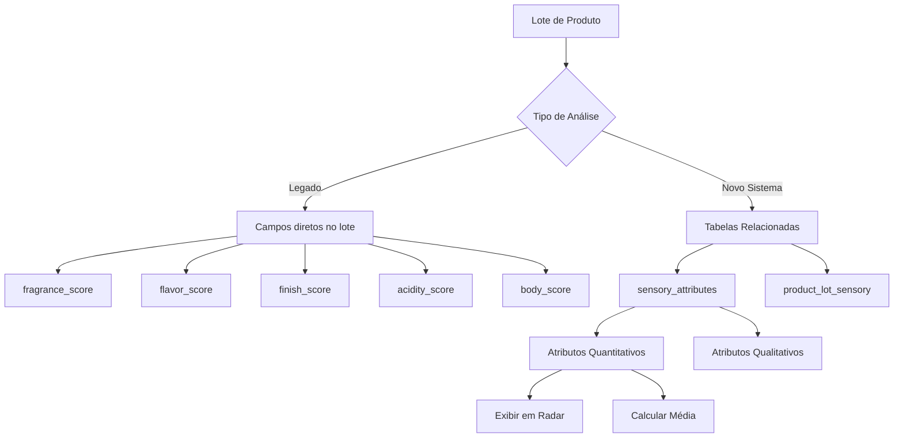
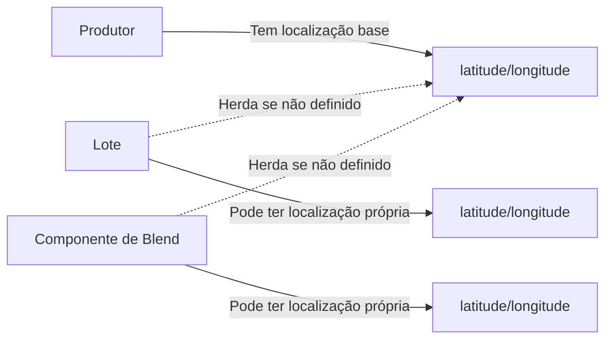
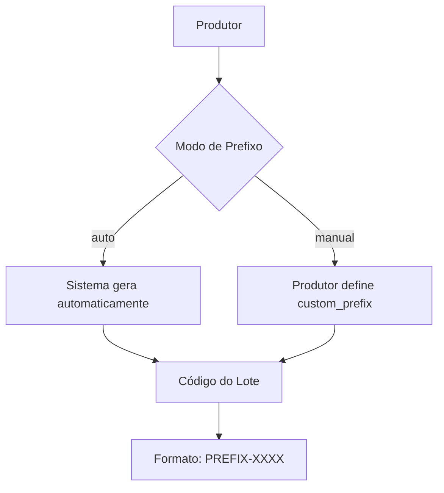
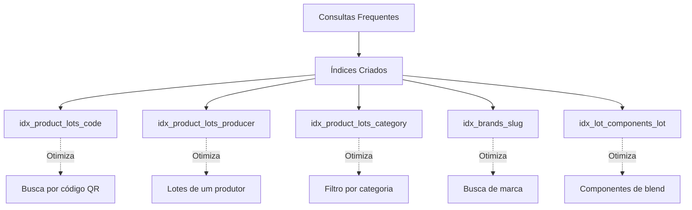
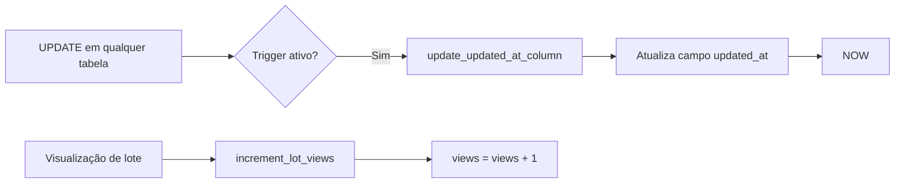
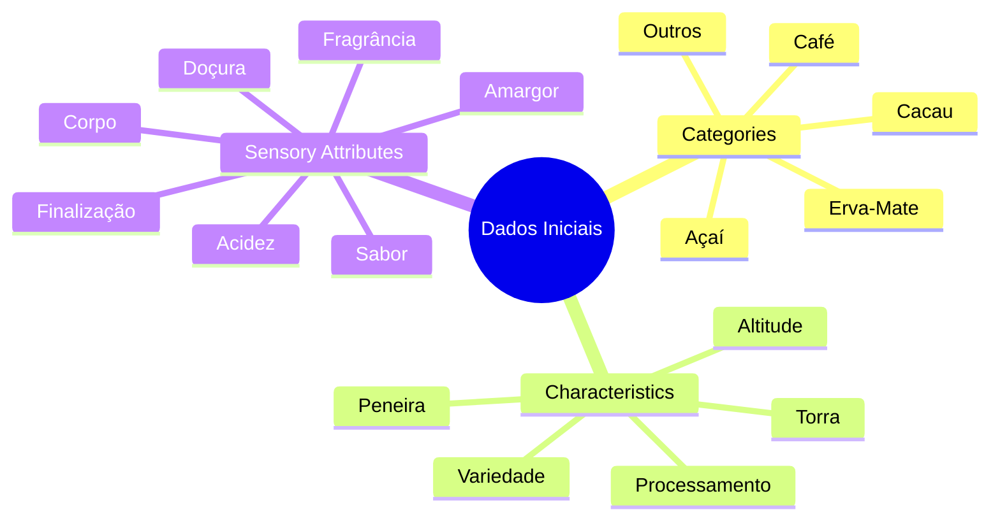

# 📊 Diagrama do Banco de Dados - Viva Rastrea

## Diagrama ER (Entity Relationship)

## Fluxo de Dados Principal

## Arquitetura de Segurança (RLS)

## Fluxo de Criação de Lote Blend

## Estrutura de Análise Sensorial

## Relacionamentos de Localização

## Sistema de Prefixos de Lote

## Índices e Performance

## Triggers Automáticos

## Dados Iniciais Incluídos

## Legenda

- **PK**: Primary Key (Chave Primária)
- **FK**: Foreign Key (Chave Estrangeira)
- **UK**: Unique Key (Chave Única)
- **||--o{**: Um para Muitos
- **}o--||**: Muitos para Um
- **}o--o{**: Muitos para Muitos

---

**Nota**: Para visualizar os diagramas Mermaid, use:
- GitHub (renderiza automaticamente)
- VS Code com extensão Mermaid
- [Mermaid Live Editor](https://mermaid.live/)
- Qualquer visualizador Markdown que suporte Mermaid
